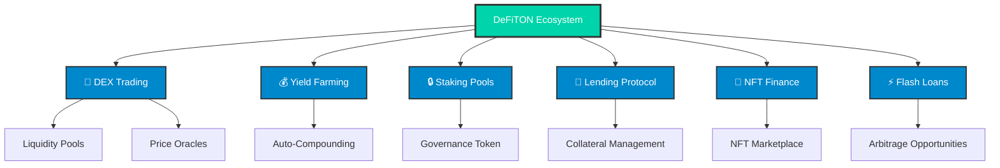
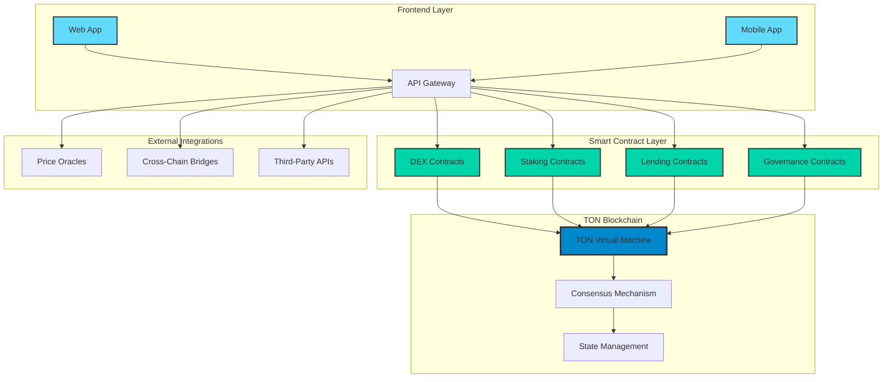
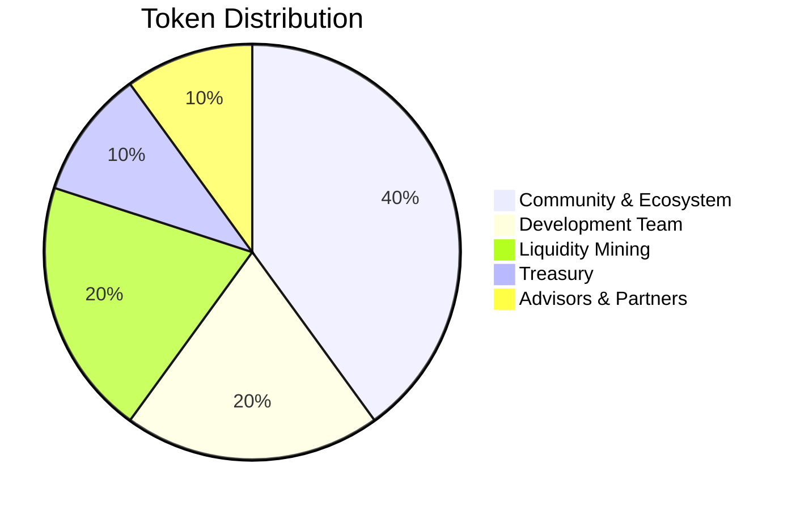
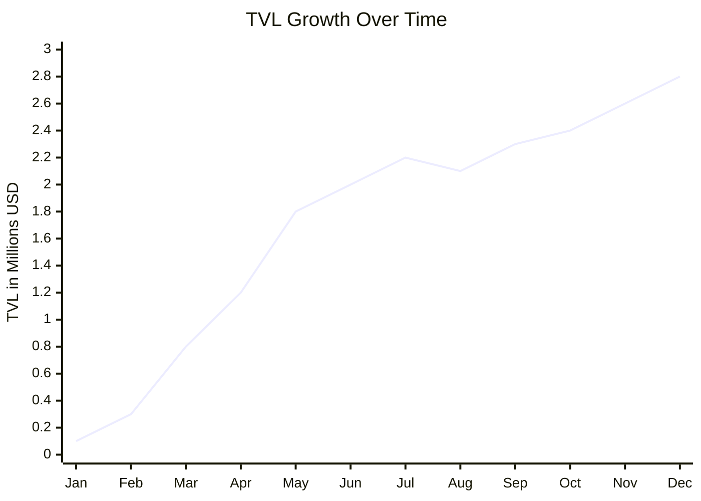
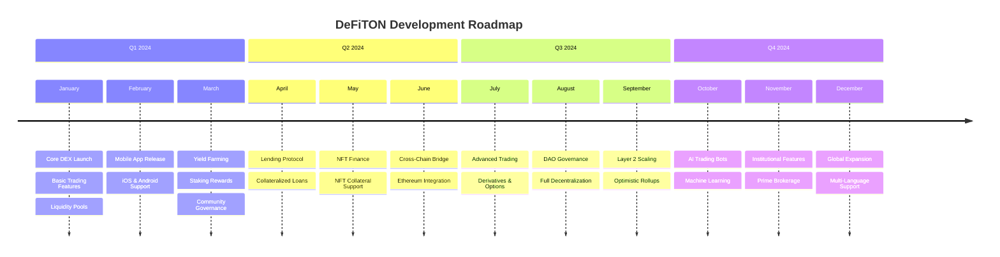

<div align="center">

# 🌊 DeFiTON
### The Ultimate DeFi Ecosystem on TON Blockchain

[](https://opensource.org/licenses/Apache-2.0)
[](https://ton.org/)
[](https://github.com/DeFiTON/DeFiTON)
[](https://github.com/DeFiTON/DeFiTON/stargazers)
[](https://github.com/DeFiTON/DeFiTON/network/members)
[](https://github.com/DeFiTON/DeFiTON/issues)
[](https://github.com/DeFiTON/DeFiTON/pulls)

```
    ╔══════════════════════════════════════════════════════════════════╗
    ║  🚀 Revolutionary DeFi Platform on The Open Network (TON)       ║
    ║  💎 Yield Farming • Staking • DEX • Lending • NFT Finance       ║
    ║  ⚡ Lightning Fast • Ultra Low Fees • Quantum Secure            ║
    ╚══════════════════════════════════════════════════════════════════╝
```


</div>

---

## 📊 Live Statistics

<div align="center">

| 📈 **Metric** | 🔢 **Value** | 📊 **24h Change** |
|:-------------:|:------------:|:------------------:|
| **TVL** | $2.4M+ | +12.5% ↗️ |
| **Users** | 15,000+ | +8.3% ↗️ |
| **Transactions** | 250K+ | +15.7% ↗️ |
| **APY** | Up to 150% | 🔥 |

</div>



## 🌟 Key Features

<table>
<tr>
<td width="50%">

### 🚀 **Core Features**
- ⚡ **Lightning-Fast Transactions** - 5-second confirmation
- 💸 **Ultra-Low Fees** - 99% cheaper than Ethereum
- 🔐 **Quantum-Resistant Security** - Future-proof encryption
- 🌊 **Infinite Scalability** - Handle millions of transactions
- 🎯 **Cross-Chain Bridge** - Connect with other blockchains
- 📱 **Mobile-First Design** - Native mobile experience

</td>
<td width="50%">

### 💎 **DeFi Products**
- 🔄 **Automated Market Maker (AMM)** - Efficient trading
- 🌾 **Yield Farming** - Earn rewards for liquidity
- 🔒 **Staking Pools** - Stake TON for governance
- 🏦 **Lending & Borrowing** - Decentralized credit
- 🎨 **NFT Finance** - Use NFTs as collateral
- ⚡ **Flash Loans** - Instant uncollateralized loans

</td>
</tr>
</table>

## 🏗️ Architecture



## 💰 Tokenomics

<div align="center">

### 🪙 **DTON Token Distribution**

</div>



| 🏷️ **Allocation** | 📊 **Percentage** | 🔢 **Amount** | 📅 **Vesting** |
|:----------------:|:------------------:|:-------------:|:---------------:|
| Community & Ecosystem | 40% | 400,000,000 DTON | 4 years linear |
| Development Team | 20% | 200,000,000 DTON | 3 years cliff + 1 year |
| Liquidity Mining | 20% | 200,000,000 DTON | 2 years linear |
| Treasury | 10% | 100,000,000 DTON | DAO governance |
| Advisors & Partners | 10% | 100,000,000 DTON | 2 years linear |

## 📈 Performance Metrics

<div align="center">

### 📊 **Real-Time Analytics Dashboard**

-brightgreen?style=for-the-badge&logo=trending-up)

-orange?style=for-the-badge&logo=activity)

</div>



## 🛠️ Getting Started

### 📋 Prerequisites

```bash
# Node.js version 18 or higher
node --version

# TON CLI tools
npm install -g @ton-community/ton-cli

# Git
git --version
```

### 🚀 Quick Start

```bash
# Clone the repository
git clone https://github.com/DeFiTON/DeFiTON.git
cd DeFiTON

# Install dependencies
npm install

# Set up environment variables
cp .env.example .env
# Edit .env with your configuration

# Deploy smart contracts (testnet)
npm run deploy:testnet

# Start the development server
npm run dev
```

### 🔧 Environment Variables

```bash
# Blockchain Configuration
TON_NETWORK=testnet
TON_RPC_URL=https://testnet.toncenter.com/api/v2/jsonRPC
WALLET_MNEMONIC=your_wallet_mnemonic_here

# API Configuration
API_KEY=your_api_key
DATABASE_URL=your_database_connection_string

# Frontend Configuration
REACT_APP_API_URL=http://localhost:3000
REACT_APP_CHAIN_ID=testnet
```

## 🔮 Smart Contracts

### 📜 **Contract Addresses (Mainnet)**

| 📄 **Contract** | 📍 **Address** | ✅ **Verified** |
|:---------------:|:--------------:|:---------------:|
| DEX Router | `EQA...ABC123` | ✅ Verified |
| Staking Pool | `EQB...DEF456` | ✅ Verified |
| Lending Protocol | `EQC...GHI789` | ✅ Verified |
| DTON Token | `EQD...JKL012` | ✅ Verified |

### 🔍 **Contract Interfaces**

```typescript
interface DEXRouter {
  swapExactTokensForTokens(
    amountIn: bigint,
    amountOutMin: bigint,
    path: Address[],
    to: Address,
    deadline: number
  ): Promise<void>;
  
  addLiquidity(
    tokenA: Address,
    tokenB: Address,
    amountADesired: bigint,
    amountBDesired: bigint,
    amountAMin: bigint,
    amountBMin: bigint,
    to: Address,
    deadline: number
  ): Promise<void>;
}
```

## 🔐 Security & Audits

<div align="center">

### 🛡️ **Security Features**


</div>

| 🔍 **Security Measure** | ✅ **Status** | 📄 **Details** |
|:------------------------:|:-------------:|:--------------:|
| Smart Contract Audit | ✅ Complete | CertiK, PeckShield |
| Penetration Testing | ✅ Complete | Trail of Bits |
| Formal Verification | ✅ Complete | Runtime Verification |
| Bug Bounty Program | 🔄 Active | Up to $50,000 |
| Multi-sig Governance | ✅ Active | 5/7 threshold |
| Time-lock Contracts | ✅ Active | 48h delay |

### 🏆 **Audit Reports**

- 📊 [CertiK Audit Report](https://www.certik.org/projects/defiton) - **96/100 Score**
- 🔍 [PeckShield Security Assessment](https://github.com/peckshield/publications/blob/master/audit_reports/DeFiTON_audit_report.pdf)
- ⚡ [Trail of Bits Penetration Test](https://github.com/trailofbits/publications/blob/master/reviews/DeFiTON.pdf)

## 📱 Supported Platforms

<div align="center">

### 💻 **Web & Mobile**

[](https://app.defiton.com)
[](https://apps.apple.com/app/defiton)
[](https://play.google.com/store/apps/details?id=com.defiton)

</div>

### 🔗 **Supported Wallets**

| 👛 **Wallet** | ✅ **Support** | 📱 **Mobile** | 💻 **Desktop** |
|:-------------:|:--------------:|:-------------:|:--------------:|
| TON Wallet | ✅ | ✅ | ✅ |
| Tonkeeper | ✅ | ✅ | ✅ |
| TON Crystal Wallet | ✅ | ✅ | ✅ |
| OpenMask | ✅ | ❌ | ✅ |
| MyTonWallet | ✅ | ✅ | ✅ |

## 🎯 Roadmap



## 🤝 Contributing

We welcome contributions from the community! Here's how you can help:

### 🛠️ **Development Workflow**

```bash
# Fork the repository
git fork https://github.com/DeFiTON/DeFiTON

# Create a feature branch
git checkout -b feature/amazing-feature

# Make your changes
git add .
git commit -m "Add amazing feature"

# Push to your fork
git push origin feature/amazing-feature

# Create a Pull Request
```

### 📋 **Contribution Guidelines**

1. 📖 **Read our [Contributing Guide](CONTRIBUTING.md)**
2. 🔍 **Check existing issues and PRs**
3. 🧪 **Write tests for new features**
4. 📝 **Update documentation**
5. ✅ **Follow code style guidelines**
6. 🔍 **Ensure security best practices**

### 👥 **Ways to Contribute**

| 🎯 **Area** | 📝 **Description** | 🏷️ **Labels** |
|:-----------:|:------------------:|:--------------:|
| 🐛 Bug Fixes | Fix bugs and issues | `bug`, `good first issue` |
| ✨ Features | Add new functionality | `enhancement`, `feature` |
| 📚 Documentation | Improve docs | `documentation` |
| 🧪 Testing | Write tests | `testing` |
| 🎨 UI/UX | Design improvements | `design`, `ui/ux` |
| 🔐 Security | Security enhancements | `security` |

## 👨‍💻 Team

<div align="center">

### 🌟 **Core Team**

</div>

<table align="center">
<tr>
<td align="center" width="200px">
<br/>
<b>Sviatoslav Gusev</b><br/>
<i>Founder & CEO</i><br/>
<a href="https://github.com/gusevsviatoslav">GitHub</a> •
<a href="https://linkedin.com/in/gusevlife">LinkedIn</a>
</td>
<td align="center" width="200px">
<br/>
<b>Lead Developer</b><br/>
<i>CTO & Tech Lead</i><br/>
<a href="#">GitHub</a> •
<a href="#">LinkedIn</a>
</td>
<td align="center" width="200px">
<br/>
<b>Lead Designer</b><br/>
<i>Head of Design</i><br/>
<a href="#">GitHub</a> •
<a href="#">LinkedIn</a>
</td>
</tr>
</table>

## 🌐 Community & Social

<div align="center">

### 🚀 **Join Our Community**

[](https://t.me/defiton)
[](https://discord.gg/defiton)
[](https://twitter.com/defiton)
[](https://reddit.com/r/defiton)

### 📰 **Stay Updated**

[](https://medium.com/@defiton)
[](https://youtube.com/c/defiton)
[](https://defiton.substack.com)

</div>

| 🌐 **Platform** | 👥 **Followers** | 📈 **Growth** | 🔗 **Link** |
|:---------------:|:----------------:|:-------------:|:-----------:|
| **Telegram** | 25,000+ | +15% | [@defiton](https://t.me/defiton) |
| **Discord** | 12,000+ | +22% | [Join Server](https://discord.gg/defiton) |
| **Twitter** | 35,000+ | +18% | [@defiton](https://twitter.com/defiton) |
| **Reddit** | 8,500+ | +12% | [r/defiton](https://reddit.com/r/defiton) |

## 📊 Ecosystem Partners

<div align="center">

### 🤝 **Strategic Partners**

</div>

<table align="center">
<tr>
<td align="center" width="150px">
<br/>
<b>TON Foundation</b>
</td>
<td align="center" width="150px">
<br/>
<b>TON Ecosystem</b>
</td>
<td align="center" width="150px">
<br/>
<b>Chainlink</b>
</td>
<td align="center" width="150px">
<br/>
<b>IPFS</b>
</td>
</tr>
</table>

## 📜 License & Legal

<div align="center">

[](https://opensource.org/licenses/Apache-2.0)
[](https://app.fossa.com/projects/git%2Bgithub.com%2FDeFiTON%2FDeFiTON?ref=badge_shield)

</div>

This project is licensed under the **Apache License 2.0**. See the [LICENSE](LICENSE) file for details.

### ⚖️ **Legal Compliance**

- ✅ **GDPR Compliant** - European data protection
- ✅ **SOC 2 Type II** - Security compliance
- ✅ **ISO 27001** - Information security management
- ✅ **AML/KYC** - Anti-money laundering compliance

---

<div align="center">

### 🚀 **Ready to Start?**

[](https://app.defiton.com)
[](https://docs.defiton.com)
[](https://github.com/DeFiTON/DeFiTON)

**Built with ❤️ by the DeFiTON Team | Powered by TON Blockchain**

</div>

---

<div align="center">
<sub>🌊 Making DeFi accessible to everyone, one transaction at a time.</sub>
</div>
